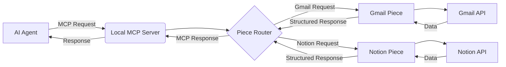

# Mobile LemonAI Implementation Change Proposal

## Overview
This proposal outlines the transformation of the existing LemonAI JavaScript-based agent system into a mobile-first workflow automation platform that works on both Android and iOS. This is **NOT** a browser replacement - it's a workflow launcher that uses WebView for UI presentation while leveraging native capabilities for automation.

## Motivation
The current LemonAI system runs primarily in browser environments, but there's a growing need for mobile workflow automation capabilities. Users want to automate tasks on their mobile devices, especially for productivity apps like Gmail and Notion, without being restricted by browser-based limitations.

## Architecture Requirements

### DO NOT:
- Rewrite LemonAI in Kotlin/Swift (keep core in JavaScript)
- Use React Native for the WebView container
- Attempt to run full MCP server on iOS
- Use Appium or WebDriver (violates App Store policies)
- Remove Node.js backend (critical for Android background services)

### MUST:
- Implement a hybrid architecture with minimal native containers
- Use nodejs-mobile for Android background services
- Implement Accessibility Service pattern (like Panda) for Android UI automation
- Use Shortcuts API for iOS automation
- Keep MCP pieces running in WebAssembly for browser context

## Implementation Plan (Phased Approach)

### PHASE 1: MOBILE CONTAINER (ANDROID & iOS)

#### Android (Kotlin):
```kotlin
// MainActivity.kt
class MainActivity : AppCompatActivity() {
    override fun onCreate(savedInstanceState: Bundle?) {
        super.onCreate(savedInstanceState)
        setContentView(R.layout.activity_main)
        
        // 1. Initialize nodejs-mobile for MCP background service
        NodeServiceHelper.init(this)
        
        // 2. Set up WebView with proper JavaScript interface
        val webView = findViewById<WebView>(R.id.webview)
        webView.settings.javaScriptEnabled = true
        webView.addJavascriptInterface(WebViewBridge(this), "NativeBridge")
        
        // 3. Load LemonAI UI from local assets
        webView.loadUrl("file:///android_asset/www/index.html")
        
        // 4. Initialize Accessibility Service for UI automation
        setupAccessibilityService()
    }
    
    private fun setupAccessibilityService() {
        // Implement pattern similar to Panda's approach
        // Register service that can interact with other apps' UI
    }
}
```

#### iOS (Swift):
```swift
// ViewController.swift
class ViewController: UIViewController {
    var webView: WKWebView!
    
    override func viewDidLoad() {
        super.viewDidLoad()
        
        // 1. Configure WebView
        let webConfiguration = WKWebViewConfiguration()
        webView = WKWebView(frame: .zero, configuration: webConfiguration)
        webView.navigationDelegate = self
        view = webView
        
        // 2. Load LemonAI UI from local bundle
        if let url = Bundle.main.url(forResource: "index", withExtension: "html", subdirectory: "www") {
            webView.loadFileURL(url, allowingReadAccessTo: url.deletingLastPathComponent())
        }
        
        // 3. Set up Shortcuts API integration
        setupShortcutsIntegration()
    }
    
    func setupShortcutsIntegration() {
        // Implement Apple-approved Shortcuts API for workflow automation
    }
}
```

### PHASE 2: PUTER.JS INTEGRATION (SERVERLESS BACKEND)

#### Authentication & Data Storage:
- Replace all existing authentication with Puter.js
- Use Puter.js for all user data storage (no separate database needed)
- Implement zero-backend architecture using Puter.js capabilities
- Replace the existing Bring Your Own Key setting in lemonai with access to AI APIs through puter.js only

```javascript
// auth.service.js
import { auth, storage, database } from 'puter.js';

// Initialize Puter.js (no API keys required)
await auth.init();

// Login
export const login = async () => {
  return await auth.signIn();
};

// Save user preferences
export const saveUserPreferences = async (preferences) => {
  const user = await auth.getCurrentUser();
  return await database.set(`users/${user.id}/preferences`, preferences);
};

// Access MCP pieces through Puter.js storage
export const loadMcpPieces = async () => {
  return await storage.getFile('mcp/pieces/wasm-pieces.js');
};
```

#### Critical Implementation Notes for Puter.js:
- Always refer to 'puterdocs.md' file
- No backend code or API keys required - just include the script
- All authentication flows handled by Puter.js directly in frontend
- User data automatically synchronized across devices via Puter's cloud services
- Implement proper error handling for offline scenarios
- for all the AI APIs and LLM APIs, you must use puter.js

### PHASE 3: MOBILE-SPECIFIC ADAPTATIONS

#### 1. MCP Runtime Adaptation:
- Keep LemonAI's core MCP implementation
- Modify runtime to use nodejs-mobile on Android instead of Docker
- For iOS, implement Shortcuts API integration instead of direct MCP execution

```javascript
// runtime/mobile.js
import { isAndroid, isIOS } from '@src/utils/platform';
import { NativeModules } from 'react-native'; // Only for WebView bridge

class MobileRuntime {
  constructor() {
    this.mcpServer = null;
  }
  
  async start() {
    if (isAndroid) {
      // Android: Use nodejs-mobile to run MCP server
      this.mcpServer = await NativeModules.NodeService.startMcpServer();
    } else if (isIOS) {
      // iOS: Don't run MCP server - use Shortcuts API instead
      console.log("iOS: Using Shortcuts API for automation");
    }
  }
  
  async executePiece(pieceName, params) {
    if (isAndroid) {
      // Android: Call MCP server through nodejs-mobile
      return await fetch('http://localhost:8080/pieces/' + pieceName, {
        method: 'POST',
        body: JSON.stringify(params)
      }).then(res => res.json());
    } else if (isIOS) {
      // iOS: Generate Shortcuts automation
      return await this.generateShortcutsAutomation(pieceName, params);
    }
  }
  
  async generateShortcutsAutomation(pieceName, params) {
    // Implementation to create Apple Shortcuts based on pieceName
    // This will be used to automate other iOS apps
  }
}
```

#### 2. WebView Communication Bridge:
- Implement secure communication between WebView and native layer
- Only expose necessary functionality through the bridge
- Handle Android accessibility permissions properly

```javascript
// native-bridge.js
export const NativeBridge = {
  // Android only - request accessibility permission
  requestAccessibilityPermission: () => {
    if (window.NativeBridge && window.NativeBridge.requestAccessibilityPermission) {
      return window.NativeBridge.requestAccessibilityPermission();
    }
    return Promise.resolve(false);
  },
  
 // iOS only - request Shortcuts permission
  requestShortcutsPermission: () => {
    if (window.webkit && window.webkit.messageHandlers && window.webkit.messageHandlers.requestShortcutsPermission) {
      return new Promise((resolve) => {
        window.webkit.messageHandlers.requestShortcutsPermission.postMessage({});
        // Response handled through separate callback
      });
    }
    return Promise.resolve(false);
  },
  
  // Universal - check if automation is available
  isAutomationAvailable: () => {
    return isAndroid ? 
      window.NativeBridge?.isAccessibilityServiceEnabled?.() : 
      window.webkit?.messageHandlers?.isShortcutsAvailable?.();
  }
};
```

### PHASE 4: WORKFLOW ENGINE IMPLEMENTATION

#### Android Workflow Engine:
- Implement simplified version of Panda's accessibility approach
- Create TaskManager that tracks workflow execution state
- Use Android's Accessibility API to interact with other apps

```javascript
// workflow/android.js
class AndroidWorkflowEngine {
  constructor() {
    this.currentApp = 'browser';
    this.taskQueue = [];
  }
  
  async switchApp(appName) {
    // Use Android's accessibility service to switch apps
    return new Promise((resolve) => {
      window.NativeBridge.switchToApp(appName, (result) => {
        this.currentApp = appName;
        resolve(result);
      });
    });
  }
  
  async executeWorkflow(steps) {
    for (const step of steps) {
      switch(step.type) {
        case 'APP_SWITCH':
          await this.switchApp(step.appName);
          break;
        case 'FORM_FILL':
          await this.fillForm(step.fields);
          break;
        case 'CLICK':
          await this.clickElement(step.selector);
          break;
        // Additional workflow step types
      }
    }
 }
}
```

#### iOS Workflow Implementation:
- Generate Shortcuts automation instead of direct execution
- Create visual workflow editor that compiles to Shortcuts
- Implement "Run in Shortcuts" button for complex workflows

```javascript
// workflow/ios.js
class iOSWorkflowEngine {
  async generateShortcuts(steps) {
    const shortcut = {
      WFWorkflowActions: []
    };
    
    for (const step of steps) {
      switch(step.type) {
        case 'APP_SWITCH':
          shortcut.WFWorkflowActions.push({
            WFWorkflowActionIdentifier: 'is.workflow.actions.openapp',
            WFWorkflowActionParameters: {
              WFApp: step.appName
            }
          });
          break;
        case 'FORM_FILL':
          // Convert to appropriate Shortcuts actions
          break;
        // Additional workflow step types
      }
    }
    
    return shortcut;
  }
  
  async executeWorkflow(steps) {
    const shortcut = await this.generateShortcuts(steps);
    // Convert to plist format and provide download link
    const plist = this.convertToPlist(shortcut);
    return {
      type: 'shortcuts',
      data: plist,
      message: 'Workflow generated for iOS Shortcuts app'
    };
  }
}
```

## Implementation Constraints & Guidelines

1. **Keep it minimal** - Your Android APK should be under 5MB (just WebView + nodejs-mobile)
2. **No Docker** - Remove all Docker dependencies from LemonAI
3. **Start with Gmail & Notion** - Only bundle these MCP pieces initially
4. **Use WASM for pieces** - Implement wasm-pieces.js for browser context execution
5. **Background processing** - Android must use nodejs-mobile's foreground service mode
6. **Authentication** - All auth must go through Puter.js (no separate auth system)
7. **Data storage** - User data must use Puter.js storage (no separate database)

## Expected Final Architecture

```
Mobile LemonAI (Hybrid Architecture)
│
├── Native Container (Kotlin/Swift)
│   ├── Android: WebView + nodejs-mobile + Accessibility Service
│   └── iOS: WKWebView + Shortcuts API integration
│
├── LemonAI Core (JavaScript - UNMODIFIED except for mobile adaptations)
│   ├── Agent System
│   ├── UI Components
│   └── Workflow Engine
│
├── MCP Runtime
│   ├── Android: nodejs-mobile serving MCP pieces
│   └── iOS: Shortcuts API integration (no direct MCP)
│
└── Backend Services (via Puter.js)
    ├── Authentication
    ├── User Data Storage
    └── Cloud Services
```

## Deliverables

- [ ] Minimal Android Kotlin container (under 500 lines)
- [ ] Minimal iOS Swift container (under 500 lines)
- [ ] Puter.js integration for all auth and data storage
- [ ] nodejs-mobile integration for Android background services
- [ ] Accessibility Service implementation (Android)
- [ ] Shortcuts API integration (iOS)
- [ ] WASM implementation for MCP pieces (Gmail & Notion only)
- [ ] Simplified workflow engine (Android) and Shortcuts generator (iOS)
- [ ] Documentation for building and deploying

## Critical Reminder

**This is NOT a browser** - it's a workflow launcher that happens to use WebView for UI presentation. Mobile OS restrictions prevent true browser automation, but they allow system-level automation tools (Accessibility Service on Android, Shortcuts on iOS). Focus on building a workflow execution platform, not another browser.

Remember: "SHIP V1 Mobile: Android app + iOS Shortcut generator | *Not a browser* — a **workflow launcher** (5MB APK)"

## Pieces Implementation Details

### What Are "Pieces" and Why They Matter

**Pieces are lightweight, standalone integration modules** that enable your AI agent to interact with external services (like Gmail and Notion) through the Model Context Protocol (MCP). Think of them as "API adapters" specifically designed for AI agents.

### Technical Definition
- They are npm packages (e.g., `@activepieces/piece-gmail`, `@activepieces/piece-notion`)
- Each piece is a self-contained JavaScript module (~2MB max)
- They implement the MCP specification to standardize communication between AI agents and external services
- They handle authentication, API calls, error handling, and data transformation

### Why We're Using Only Gmail & Notion (For Now)
These two services represent the **most valuable starting point** for non-technical users:
- Gmail: Universal communication platform (email management, attachments, etc.)
- Notion: Popular knowledge/workflow management tool
- Together they enable the "Save Gmail attachments to Notion" workflow that's the core MVP

### How Pieces Work in Our Mobile Architecture

#### Core Concept: Local MCP Server
Unlike cloud-hosted solutions, **we run a local MCP server** on the user's device that:
1. Hosts the Gmail and Notion pieces
2. Handles authentication flows securely
3. Translates AI agent requests into service-specific API calls
4. Returns structured data back to the agent

#### Android Implementation Strategy


1. **Node.js Mobile Backend**:
   - We use `nodejs-mobile` to run a minimal MCP server in the background
   - This server loads ONLY the Gmail and Notion pieces
   - It runs as a foreground service to avoid Android background restrictions

2. **Critical Code Structure**:
```javascript
// src/mcp/local-server.js
const { PieceMcpServer } = require('@activepieces/piece-mcp');
const gmail = require('@activepieces/piece-gmail');
const notion = require('@activepieces/piece-notion');

// ONLY load the pieces we need (keeps size minimal)
const server = new PieceMcpServer({
  pieces: [gmail, notion],
  port: 3000
});

server.start();
console.log('MCP server running with Gmail & Notion pieces only');
```

#### iOS Implementation Strategy
Since iOS restricts background processes, we take a different approach:

1. **WASM Execution for UI Layer**:
   - Use `wasm-pieces.js` to run the pieces directly in the WebView
   - This handles the UI interactions and simple operations

2. **Shortcuts API for Heavy Lifting**:
   - Complex operations trigger iOS Shortcuts
   - Shortcuts handle the actual service interaction
   - Results are passed back to the WebView

```javascript
// src/mcp/ios-adapter.js
class IosMcpAdapter {
  async executePiece(pieceName, action, params) {
    if (isIos()) {
      // For iOS, generate and trigger Shortcuts instead of direct execution
      return this.generateShortcutsAutomation(pieceName, action, params);
    }
    // Fallback to standard execution for other platforms
    return fetch(`http://localhost:3000/pieces/${pieceName}/${action}`, {
      method: 'POST',
      body: JSON.stringify(params)
    }).then(res => res.json());
  }
  
  async generateShortcutsAutomation(pieceName, action, params) {
    // Convert MCP request to Apple Shortcuts format
    const shortcut = {
      WFWorkflowActions: []
    };
    
    // Gmail-specific shortcut generation
    if (pieceName === 'gmail' && action === 'listEmails') {
      shortcut.WFWorkflowActions.push({
        WFWorkflowActionIdentifier: 'is.workflow.actions.getlatestemail',
        WFWorkflowActionParameters: {
          WFMailbox: params.label || 'INBOX'
        }
      });
    }
    
    // Return the shortcut configuration that will be triggered
    return {
      type: 'shortcuts',
      data: shortcut,
      message: 'Generated iOS Shortcuts automation'
    };
  }
}
```

## Implementation Requirements

1. **Minimal Footprint**:
   - Only bundle Gmail and Notion pieces (no others)
   - Total size should be under 5MB for the MCP component

2. **Authentication Storage**:
   - Store tokens securely using platform-specific secure storage
   - Android: `EncryptedSharedPreferences`
   - iOS: Keychain Services
   - NEVER store tokens in plain text or localStorage

3. **WASM Fallback for UI Operations**:
   - For simple operations that don't require background processing
   - Use the pre-compiled `wasm-pieces.js` in the WebView

4. **Error Handling**:
   - Pieces must gracefully handle service changes (e.g., Gmail UI updates)
   - Implement "self-healing" by having the agent regenerate selectors when needed

## What the AI Coder Must Implement

1. **MCP Server Setup**:
   - Create a minimal MCP server that only loads Gmail and Notion pieces
   - Integrate with nodejs-mobile for Android background operation
   - Ensure it starts automatically when the app launches

2. **WebView Bridge**:
   - Create a secure communication channel between WebView and MCP server
   - Implement error handling for when the MCP server isn't running

3. **Authentication Flow**:
   - Implement the complete OAuth flow for both services
   - Create a simple UI for connecting/disconnecting services
   - Store tokens securely using platform-specific methods

4. **iOS Shortcuts Integration**:
   - Convert MCP requests to Shortcuts format
   - Implement the shortcut generation and triggering mechanism
   - Handle results coming back from Shortcuts

5. **Error Recovery**:
   - Implement monitoring for when service APIs change
   - Create a mechanism for the agent to detect and recover from failures

Remember: The goal is to make this **completely invisible to non-technical users**. They should just see "Connect Gmail" button and have everything work without understanding OAuth, APIs, or MCP. The complexity is entirely hidden behind a simple UI.